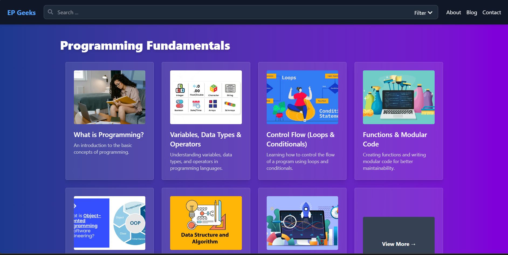
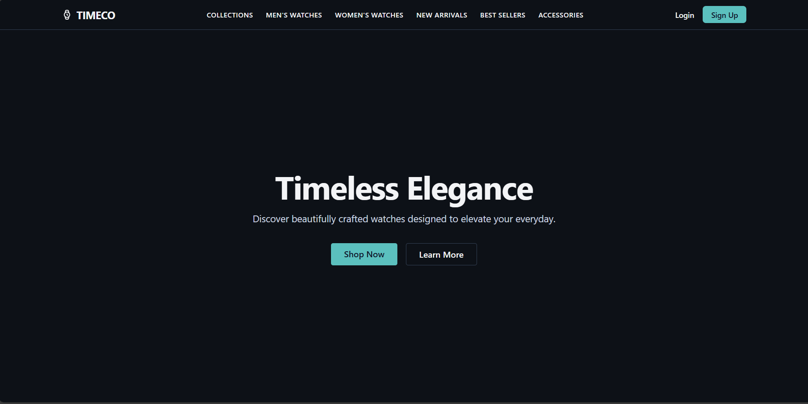
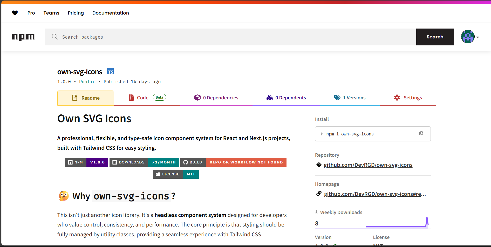
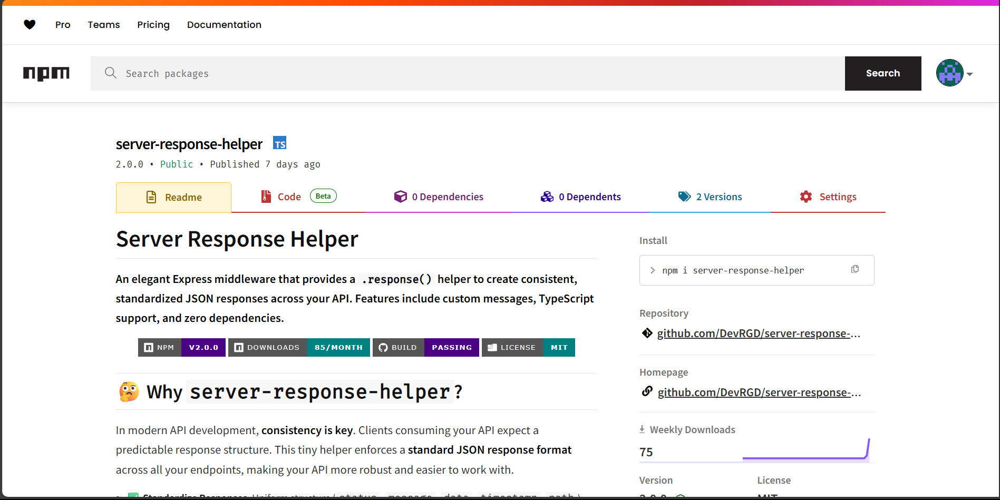

  

# 👋 Hey there, I'm **DevRGD**

---

### 👨‍💻 About Me

I'm a passionate and results-driven Full-Stack Developer based in India, specializing in building dynamic web applications and intelligent AI tools. With a strong foundation in **JavaScript** and **Python**, I transform complex problems into elegant, efficient, and scalable solutions.

As an indie hacker and freelance developer under the brand **DevRGD**, my goal is to partner with businesses and individuals to bring their digital ideas to life. Whether you need a custom web platform, a backend API, or an innovative AI-powered feature, I have the skills and entrepreneurial spirit to deliver high-quality results.

- 🌱 I’m currently exploring advanced concepts in Large Language Models (LLMs) and serverless architectures.
- 🚀 I'm passionate about building products that solve real-world problems.
- 💬 Ask me about **React, Node.js, Python, Django, and AI/ML integration**.
- 📫 Let's connect and build something amazing together! Reach out to me at **contact@devrgd.space**.

---

### My Tech Stack: Expertise and Familiarity

This outlines my technical capabilities, categorized by development area and indicating my proficiency level.

**Understanding My Skill Levels:**
* **Expertise:** Deep understanding, built substantial projects, independent troubleshooting, best practices, mentoring.
* **Proficient In:** Foundational understanding, practical experience, can work effectively, keen to deepen knowledge.

---

#### 💻 Languages & Core Tech

**Expertise:**
  

**Proficient In:**
 

---

#### 🎨 Frontend Development

**Expertise:**
  

**Proficient In:**
 

---

#### 🔧 Backend Development

**Expertise:**
 

**Proficient In:**
    

---

#### 🧠 AI / Machine Learning

**Expertise:**
  

**Proficient In:**
  

---

#### 🗄️ Databases & Servers

**Expertise:**
  

**Proficient In:**
  

---

#### ☁️ Cloud & DevOps

**Expertise:**
   

**Proficient In:**
 

---

#### 🛠️ Tools & Others

**Expertise:**
   

**Proficient In:**

---

### 🚀 Showcase
_Projects that reflect my journey as a full-stack developer and AI enthusiast — each one built with a focus on performance, usability, and clean architecture._

<table width="100%" style="border-collapse: separate; border-spacing: 16px;">
  <tr>
    <td width="50%" valign="top" style="background-color: #161b22; border: 1px solid #30363d; border-radius: 4px; padding: 16px;">
      

        <h3 align="center" style="min-height: 50px;">Encode Preneur</h3>
        
        

          This project is a feature-rich learning platform built with Next.js, designed for scalability, SEO optimization, and performance. It provides structured educational content across various domains, including programming, web development, AI, and more.
        

        
<strong>Tech Stack:</strong> NextJs, Tailwind, MongoDB, Vercel

        

          
          
        

      

    </td>
    <td width="50%" valign="top" style="background-color: #161b22; border: 1px solid #30363d; border-radius: 4px; padding: 16px;">
      

        <h3 align="center" style="min-height: 50px;">TIMECO</h3>
        
        

          Shop TIMECO’s exclusive collection of timeless, minimalist, and luxurious wristwatches. Crafted with precision and elegance for modern lifestyles.
        

        
<strong>Tech Stack:</strong> Next.js, Resend, MongoDB, Tailwind CSS

        

          
          
        

      

    </td>
  </tr>
  <tr>
    <td width="50%" valign="top" style="background-color: #161b22; border: 1px solid #30363d; border-radius: 4px; padding: 16px;">
      

        <h3 align="center" style="min-height: 50px;">Own SVG Icons</h3>
        
        

          A flexible, headless SVG icon system for React & Next.js with Tailwind CSS support.
        

        
<strong>Tech Stack:</strong> React, TypeScript, CI/CD, Vitest, NPM

        

          
          
        

      

    </td>
    <td width="50%" valign="top" style="background-color: #161b22; border: 1px solid #30363d; border-radius: 4px; padding: 16px;">
      

        <h3 align="center" style="min-height: 50px;">Server Response Helper</h3>
        
        

          Elegant Express middleware for consistent JSON API responses with .response(), TypeScript support, and zero dependencies.
        

        
<strong>Tech Stack:</strong> Express, TypeScript, Vitest, CI/CD, NPM

        

          
          
        

      

    </td>
  </tr>
</table>

---

### 📊 GitHub Analytics

  
    
  
    
  

